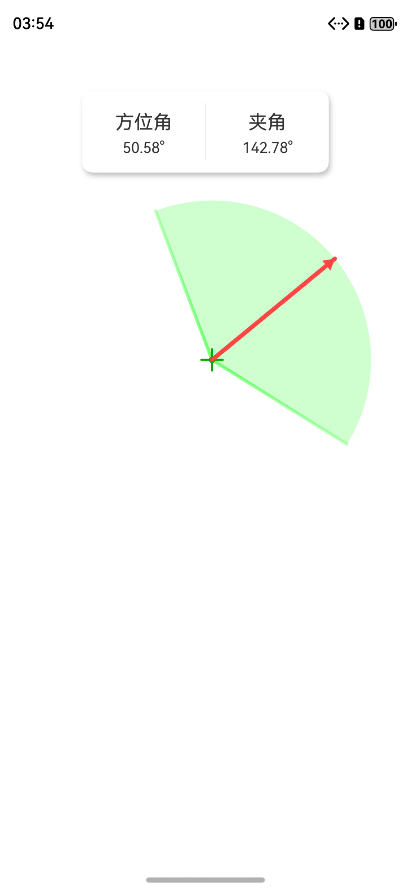

# 方位角扇形

## 介绍

方位角扇形会在页面中生成一个扇形，根据拖动的初始点击位置有不同的效果，实时显示方位角与扇形夹角。

1. 点击扇形内，会以圆心为中心点跟随拖动转动；
2. 点击扇形两条斜边，斜边会跟着拖动，对扇形进行放大缩小；
3. 扇形始终小于180度；
4. 方位角指示线以红色带箭头线展示。

## 效果预览

 

## 工程目录

```
├──sector/src/main/ets                              // har包类型
│  ├──canvas
│  │  └──Renderer.ets                               // 图形绘制
│  ├──components
│  │  └──SectorController.ets                       // 方位角扇形
│  ├──model
│  │  └──SectorModel.ets                            // 方位角数据     
│  └──util
│     └──Calculate.ets                              // 计算函数
├──sector/src/main/resources                        // 应用资源目录
│
├──entry/src/main/ets                               // 代码区
│  ├──entryability
│  │  └──EntryAbility.ets       
│  ├──entrybackupablility 
│  │  └──EntryBackupAbility.ets
│  └──pages
│     └──Index.ets                                  // 演示
└──entry/src/main/resources                         // 应用资源目录
```