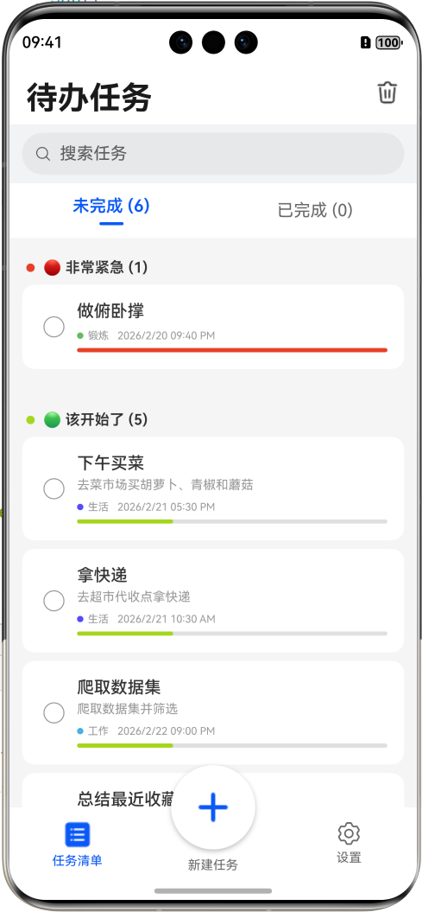
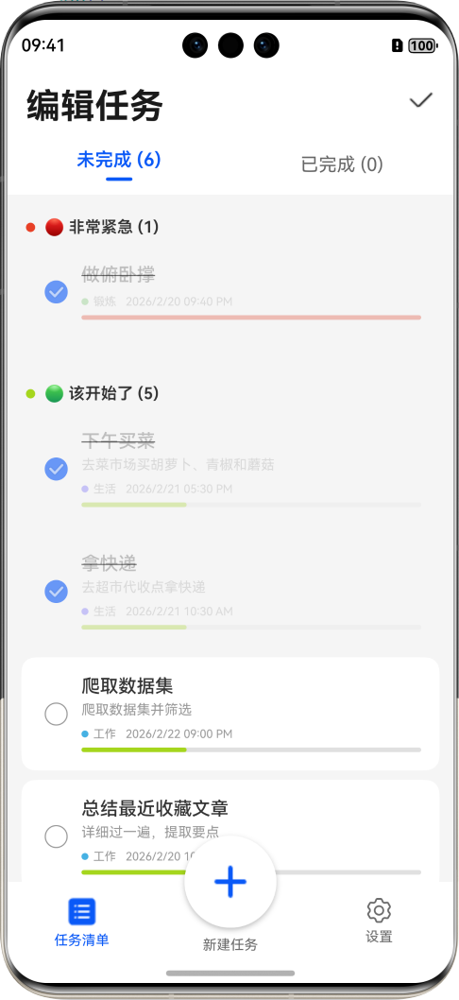

# 待办任务

## 介绍

待办任务是日常生活/学习/办公常用的应用。  
通过点击下方新建进入新建页面，可实现一站式的创建任务/创建清单分类/设置起止时间/填写详细任务。  
任务列表页面分栏展示已完成与未完成的任务，同时按照缓急展示任务，操作方便，展示直观。

## 效果预览

    

  

## 工程目录

```
├──dateTimePicker/src/main/ets                      // har包类型
│  ├──common
│  │  └──Constants.ets                              // 常量定义
│  ├──dialog
│  │  └──DateTimePickerDialog.ets                   // 日期时间选择器弹窗 
│  ├──interface
│  │  └──DateTimePickerInterface.ets                // 日期时间选择器参数接口     
│  ├──pages
│  │  └──DateTimePicker.ets                         // 日期时间选择器
│  └──utils
│     ├──DateTimeBase.ets                           // 日期时间基类
│     ├──DateTimeRange.ets                          // 日期时间范围
│     └──DateTimeSolar.ets                          // 日期时间公历类
├──dateTimePicker/src/main/resources                // 应用资源目录
│
├──entry/src/main/ets                               // 代码区
│  ├──common
│  │  ├──Constants.ets                              // 常量数据
│  │  ├──Logger.ets                                 // 日志工具
│  │  ├──TaskCategoryData.ets                       // 清单数据
│  │  └──TaskListData.ets                           // 任务数据
│  ├──components
│  │  ├──CategoryListDialog.ets                     // 清单列表弹窗
│  │  ├──NewCategoryDialog.ets                      // 新建清单弹窗
│  │  └──TaskDialog.ets                             // 任务弹窗
│  ├──database
│  │  ├──CategoryTable.ets                          // 清单表
│  │  ├──PreferenceDB.ets                           // 首选项数据库
│  │  ├──TaskDB.ets                                 // 任务数据库
│  │  └──TaskTable.ets                              // 任务表
│  ├──entryability
│  │  └──EntryAbility.ets       
│  ├──entrybackupablility 
│  │  └──EntryBackupAbility.ets
│  └──pages
│     ├──AppInformation.ets                         // 应用信息页
│     ├──Guide.ets                                  // 引导页
│     ├──MainPage.ets                               // 主页
│     ├──NewTask.ets                                // 新建任务页
│     ├──Settings.ets                               // 设置页
│     └──TaskList.ets                               // 人物列表页
└──entry/src/main/resources                         // 应用资源目录
```

## Debug日志

| 问题               | 原因                                            |解决                                             |
|--------------------|-----------------------------------------------|------------------------------------------------|
| 新建后TaskList不及时刷新 | @Builder 内的条件判断被缓存  <br>而build() 内的条件判断总是响应式的 |把条件判断从 @Builder 移到 build() 中  |